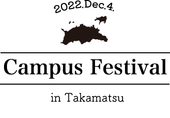

<div align="center">



# 高松キャンパスフェスティバル 2022

**N高等学校・S高等学校 高松キャンパス、初めてのキャンパスフェスティバルの告知サイト**

※ イベントは 2022 年 12 月 4 日に終了しました

</div>

高校在学中、高松キャンパスで初めて開かれた「キャンパスフェスティバル」のために作った告知用の Web サイトです。
スローガン、当日のスケジュール、会場の案内、キャンパスの写真を 1 ページにまとめました。
会場に来られない人も参加できるように、Zoom での参加方法も載せています。
また、このウェブサイトはhtml,cssを始めて3ヶ月目ほどに作成し初めて実際に公開しました。
そのため、このウェブサイトはテンプレートを用いて作成しています。

## ページ構成


| セクション     | 内容                                                                      |
| -------------- | ------------------------------------------------------------------------- |
| **Slogan**     | スローガン「ココロヤドル 〜Enjoy!高松は鳴り始める〜」と、そこに込めた思い |
| **Schedule**   | オープニングからエンディングまでのタイムテーブルと、Zoom の参加リンク     |
| **Address**    | 会場の住所、最寄り駅からの道のり、当日の注意事項                          |
| **Images**     | キャンパスの写真ギャラリー（クリックで拡大）                              |
| **On the day** | 当日の様子を投稿する、Twitter 風のタイムラインページ                      |

### スローガンに込めた思い

高松キャンパスにとって初めてのキャンフェスなので「鳴り始める」、みんなが楽しめるものにしたいので「Enjoy」を入れました。
さらに、「ココロオドル」をオマージュして「ココロヤドル」としました。

### 当日のプログラム


| 時間         | 内容                             |
| ------------ | -------------------------------- |
| 13:00〜13:15 | オープニング                     |
| 13:20〜14:00 | Kahoot! クイズ                   |
| 14:10〜15:00 | 学校紹介「高松キャンパスの日常」 |
| 15:00〜15:30 | ito                              |
| 15:30〜16:30 | ガーティックフォン               |
| 16:30〜16:45 | エンディング                     |

## 工夫したところ

### どの端末でも見やすいレスポンシブデザイン

スマートフォンからワイドディスプレイまで、5 段階のブレークポイント（380 / 800 / 950 / 1150 / 1400 px）でレイアウトを調整しました。

### 読みやすい動き

- メニューのリンクを押すと、該当するセクションまでなめらかにスクロールします
- 別のページから `#Schedule` のようなリンクで来たときも、読み込み後にその位置までスクロールします
- 下までスクロールすると「ページトップへ戻る」ボタンが表示されます
- 写真ギャラリーは Lightbox で拡大表示できます

### 当日ページ

イベント当日の様子を伝えるため、Twitter 風のタイムラインで投稿を見られるページを別に作りました。
このページのスタイルは Sass（SCSS）で書いています。

## 技術スタック


|                    |                               |
| ------------------ | ----------------------------- |
| **Markup / Style** | HTML, CSS, Sass（SCSS）       |
| **Script**         | JavaScript, jQuery, Lightbox2 |

デザインの一部は [Template-Party](https://template-party.com/) のテンプレートを参考にしています。

## ディレクトリ構成

```
.
├── index.html     # 告知ページ（スローガン、スケジュール、会場、写真）
├── css/           # スタイルとアニメーション
├── js/main.js     # スムーススクロール、ページトップボタン
├── images/        # ロゴ、背景などの画像
├── images_photo/  # 写真ギャラリーの画像
└── ontheday/      # 当日のタイムラインページ
```

## Contact

- GitHub: [@ShinoChan0](https://github.com/ShinoChan0)
- Portfolio: [portfolio.shino.zip](https://portfolio.shino.zip)
